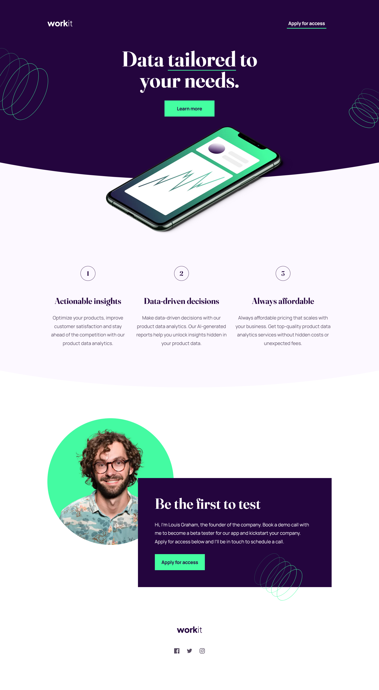
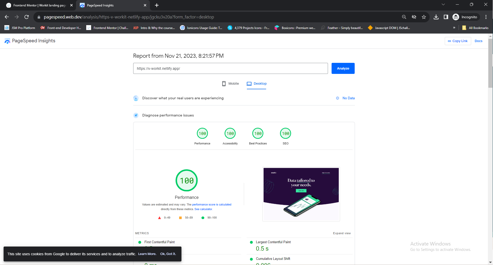

# Frontend Mentor - Workit landing page solution

This is a solution to the [Workit landing page challenge on Frontend Mentor](https://www.frontendmentor.io/challenges/workit-landing-page-2fYnyle5lu). Frontend Mentor challenges help you improve your coding skills by building realistic projects. 

## Table of contents

- [Overview](#overview)
  - [The challenge](#the-challenge)
  - [Screenshot](#screenshot)
  - [Links](#links)
- [My process](#my-process)
  - [Built with](#built-with)
  - [What I learned](#what-i-learned)
- [Author](#author)
- [Links](#links)

## Overview

### The challenge

Users should be able to:

- View the optimal layout for the interface depending on their device's screen size
- See hover and focus states for all interactive elements on the page

### Screenshot

#### Desktop View

#### Tablet View

#### Mobile View

### Links
- Live Site URL: [https://v-workit.netlify.app/](https://v-workit.netlify.app/)
- Solution URL: [https://github.com/saurav-verma-01/v-Workit](https://github.com/saurav-verma-01/v-Workit)

## My process

### Built with

- Semantic HTML5 markup
- CSS custom properties
- CSS Variables
- Flexbox
- Desktop-first workflow
- Vite - for frontend tooling
- Google PageSpeed Insights 
- Lighthuse Test - For Web Performance SEO, Accessibility Optimizations

### What I learned

In the course of completing the Frontend Mentor challenge, I am pleased to share a diverse array of skills and knowledge that I have acquired. Notably, I mastered the art of employing customized border-radius and the scale property to craft a seamlessly curved bottom for a section, aligning flawlessly with the design files provided.

Furthermore, I took significant strides in enhancing the maintainability and scalability of my code by implementing custom classes for all typography elements. This organizational approach not only streamlined the development process but also contributed to the overall efficiency of the project.

Embracing modern web development practices, I incorporated the use of CSS variables to imbue flexibility into the styling process. Additionally, I honed my skills in responsive design through the adept use of media queries, ensuring a visually cohesive and user-friendly experience across various devices.

Delving into the realm of interactive design, I integrated SVG icons into the project, leveraging the hover state to dynamically alter their colors. This nuanced touch adds a layer of engagement and visual appeal to the user interface.

One of the highlights of my learning journey was mastering CSS flexbox, a powerful tool for creating responsive and dynamic layouts. Its application in this challenge not only facilitated the alignment of elements but also bolstered the overall structure of the webpage.

Perhaps most crucially, I deepened my understanding of pivotal aspects for web performance and SEO. This involved implementing new meta tags, employing responsive image properties, and adopting strategies such as lazy loading. Providing explicit sizes to images emerged as a key practice, contributing not only to improved web performance but also positively impacting search engine optimization.

## Author

- Frontend Mentor - [@Saurav-98](https://www.frontendmentor.io/profile/Saurav-98)
- Twitter - [@SauravKverma22](https://twitter.com/SauravKverma22)
- Github - [saurav-verma-01](https://github.com/saurav-verma-01)
- Linkedin- [/in/saurav-dev/](https://www.linkedin.com/in/saurav-dev/)

## 🔗 Links
- 
- 
- 

